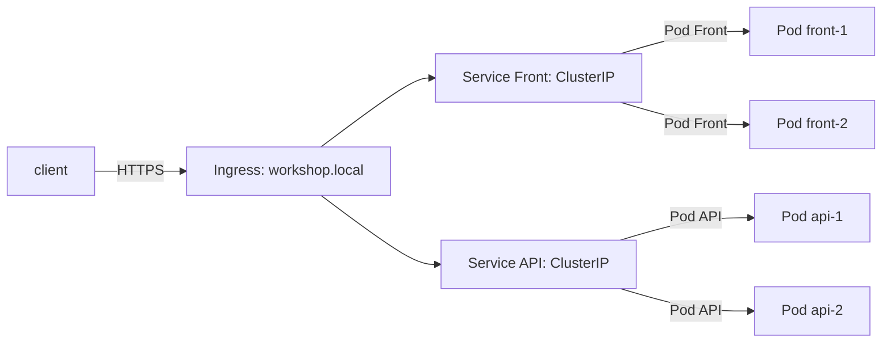

# Diagramme L7 du TP Kubernetes

```mermaid
flowchart LR
    client -->|HTTPS| ingress[Ingress: workshop.local]
    ingress --> front[Service Front: ClusterIP]
    ingress --> api[Service API: ClusterIP]
    front --> |Pod Front| front_pod1[Pod front-1]
    front --> |Pod Front| front_pod2[Pod front-2]
    api --> |Pod API| api_pod1[Pod api-1]
    api --> |Pod API| api_pod2[Pod api-2]
```
